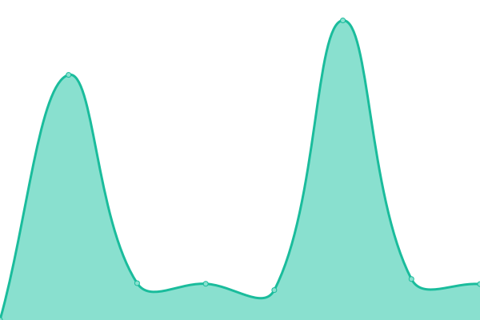

# [📈 Live Status](https://GHGHGHKO.github.io/upptime): <!--live status--> **🟩 All systems operational**

This repository contains the open-source uptime monitor and status page for [feelsgoodfrog](https://pepega.tistory.com), powered by [Upptime](https://github.com/upptime/upptime).

With [Upptime](https://upptime.js.org), you can get your own unlimited and free uptime monitor and status page, powered entirely by a GitHub repository. We use [Issues](https://github.com/GHGHGHKO/upptime/issues) as incident reports, [Actions](https://github.com/GHGHGHKO/upptime/actions) as uptime monitors, and [Pages](https://GHGHGHKO.github.io/upptime) for the status page.

<!--start: status pages-->
<!-- This summary is generated by Upptime (https://github.com/upptime/upptime) -->
<!-- Do not edit this manually, your changes will be overwritten -->
<!-- prettier-ignore -->
| URL | Status | History | Response Time | Uptime |
| --- | ------ | ------- | ------------- | ------ |
|  [klassic-quote-api](https://klassic-quote-api.mooo.com/v1/random-quote) | 🟩 Up | [klassic-quote-api.yml](https://github.com/GHGHGHKO/upptime/commits/HEAD/history/klassic-quote-api.yml) | 

 718ms
     
 | 

<a href="https://GHGHGHKO.github.io/upptime/history/klassic-quote-api">100.00%</a>
    

|  [goose-auth-api](https://goose-auth-api.mooo.com/swagger-ui/index.html) | 🟩 Up | [goose-auth-api.yml](https://github.com/GHGHGHKO/upptime/commits/HEAD/history/goose-auth-api.yml) | 

 580ms
     
 | 

<a href="https://GHGHGHKO.github.io/upptime/history/goose-auth-api">100.00%</a>
    

|  [roadmap-todo](https://roadmap-todo.mooo.com/swagger-ui/index.html) | 🟩 Up | [roadmap-todo.yml](https://github.com/GHGHGHKO/upptime/commits/HEAD/history/roadmap-todo.yml) | 

 586ms
     
 | 

<a href="https://GHGHGHKO.github.io/upptime/history/roadmap-todo">100.00%</a>
    

<!--end: status pages-->

[**Visit our status website →**](https://GHGHGHKO.github.io/upptime)

## 📄 License

- Powered by: [Upptime](https://github.com/upptime/upptime)
- Code: [MIT](./LICENSE) © [Anand Chowdhary](https://anandchowdhary.com), supported by [Pabio](https://pabio.com)
- Data in the `./history` directory: [Open Database License](https://opendatacommons.org/licenses/odbl/1-0/)
